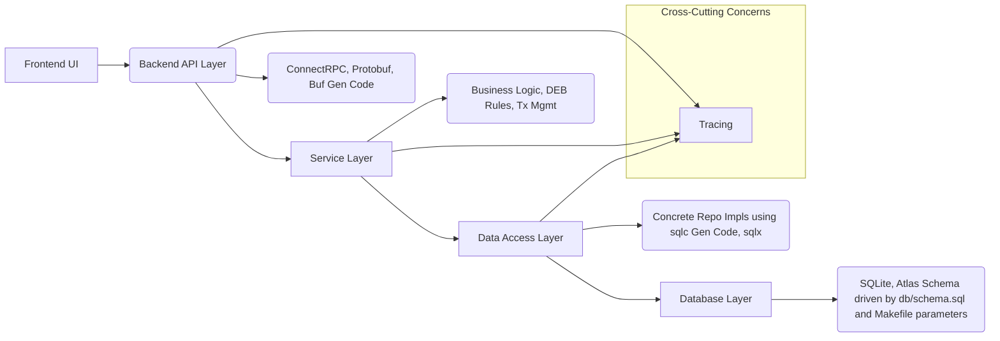

# System Patterns: Expense Manager

## System Architecture

A full-stack architecture with a frontend UI interacting with the backend API, which follows a simplified layered architecture:



A simplified layered architecture optimized for direct interaction, TDD, and specific tooling choices:

```shell
┌──────────────────────────────────────────────────┐
│                   API Layer                      │ ConnectRPC, Protobuf, Buf Gen Code
├──────────────────────────────────────────────────┤
│                  Service Layer                   │ Business Logic, DEB Rules, Tx Mgmt (in RPC Services)
├──────────────────────────────────────────────────┤
│              Data Access Layer                   │ Concrete Repo Impls using sqlc Gen Code, sqlx
├──────────────────────────────────────────────────┤
│                  Database Layer                  │ SQLite, Atlas Schema (`schema.sql` driven)
└──────────────────────────────────────────────────┘
```

## Key Design Patterns

1. **OpenTelemetry Tracing:** Integrated for distributed tracing across layers.
2. **Simplified Layered Architecture:** Direct Service-to-Repository Implementation coupling.
3. **Concrete Repository Pattern:** Data access logic grouped in `internal/repo` using sqlc.
4. **Service Layer:** Business logic within ConnectRPC service implementations.
5. **Dependency Injection (Manual):** Via constructors.
6. **Code Generation:** Buf (API), sqlc (Data Access).
7. **Configuration Management:** Direct environment variable loading via `github.com/caarlos0/env/v11`.
8. **Command Pattern (Cobra):** CLI structure.
9. **Test-Driven Development (TDD):** Service-level tests (using standard `testing`/`cmp`) drive implementation.
10. **Declarative Migrations (Atlas):** Schema state defined in `db/schema.sql`. Atlas generates versioned `UP` migration files.
11. **Mandatory Linting (`golangci-lint`):** Enforced code quality.

## Double-Entry Bookkeeping Implementation

1. **Journal-Ledger:** `transactions` (Journal) and `ledger_entries` (Ledger) tables. Balanced entries enforced.
2. **Chart of Accounts:** `accounts` table for A/L/E types only. Requires balancing Equity account. `name` is UNIQUE identifier.
3. **Classification:** Separate `categories` table (optional `parent_id`). `ledger_entries` link to `categories.id` on Equity splits.
4. **Balancing Rule:** Enforced in `CreateTransaction` service logic before DB commit.

## Critical Implementation Paths

1. **Transaction Creation (Service Logic):** Validate balance, DB Tx, call repo (with Tx) for `transactions`/`ledger_entries`, commit/rollback.
2. **Account Balance Calculation (Service Logic):** Call repo for SUMs, apply A/L/E rules.
3. **Category Reporting (Service Logic):** Call repo to query/aggregate `ledger_entries` linked to Equity account & categories. Handle `parent_id` grouping in application if needed.
4. **Cash Reconciliation (Service Logic):** Call repo to query relevant data and compare `allocation_tag` vs actual cash account `name`.

## Component Relationships

* `RPC Service` -> `Repo Implementation` (Direct Call)
* `Transaction` -> `LedgerEntry` (One-to-Many)
* `Account` -> `LedgerEntry` (One-to-Many, A/L/E only)
* `Category` -> `LedgerEntry` (Many-to-Many via link, optional, classifies Equity split)
* `Account` (*) -> `User` (*) : Via `account_users` join table.
* (Other relationships as per final ERD remain valid).
